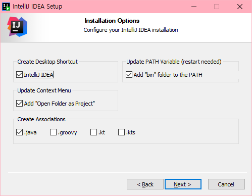

# IntelliJ
- JetBrains사에서 제작한 Java 개발을 위한 툴
- IntelliJ 혹은 IDEA 로도 불림
- https://www.jetbrains.com/idea

## IntelliJ 버전
- IntelliJ IDEA CE(Community Edition): 무료 버전, 일부 기능 제한(언어, 프레임워크, 프로파일링 등)
- IntelliJ IDEA(Ultimate): 유료 버전, 30일 무료 평가 이용 가능

## IntelliJ 설치 버전
- Standalone Installer(설치버전)
- Portable(무설치버전)
    - .exe가 아닌 .zip파일을 다운로드 하여 압축 해제, bin 폴더에서 실행파일을 찾아 실행
    - 개인적으로 쓰기 좋도록 커스터마이징 하여 다시 압축해 공유 및 재사용

### Installation Options

- Create Desktop Shortcut: 윈도우 바탕화면에 바로가기 추가
- Update PATH Variable: 설치한 프로그램의 bin 폴더 경로를 윈도우 환경변수 PATH로 자동 추가
- Update Context Menu: 프로젝트로 폴더 열기 메뉴 추가
- Create Association: 선택한 확장자 파일은 IntelliJ로 실행
  
### IntelliJ IDEA 실행 시 기본 화면
- New Project: 새 프로젝트 생성
- Open or Import: 기존 프로젝트 열기
- Get from Version Control: Github, Gitlab, SVN과 같은 VCS와 연동하여 코드 가져오기
- Configure: 환경설정(Settings), 플러그인(Plugins) 등 IntelliJ 사용을 위한 추가 설정

> **VCS(Version Control System)**
> 파일의 변화를 추적하고 관리하는 시스템

## 기본 환경 설정
Configure 메뉴에서 Settings 를 선택하여 설정 창을 열고 테마 변경, 글꼴 설정, 단축키 변경 등 개발환경 설정

### File Encoding 타입 설정
Editor > File Encodings
- IDE 레벨
- 프로젝트 레벨
- 개별 파일 레벨

### Auto Import 옵션 설정
Editor > General > Auto Import
- java
  - Add unambiguous Imports on the fly: 정확한 클래스가 하나만 있을 경우 자동으로 가져오기를 수행
  - Optimize imports on the fly: 자동으로 사용하지 않는 import 문을 제거
  
### Match case 옵션 해제
Editor > General > Code Completion
- Match Case 해제: 코드 자동완성 기능 사용 시 대소문자를 구분할지 여부를 결정

### Enable Annotation Processing 옵션 설정
Build, Execution, Deployment > Compiler > Annotation Processors
- Enable Annotation Processing 옵션 활성화: java 프로젝트에서 주석 처리기를 사용할 수 있도록 설정하는 기능, 롬복이나 MapStruct 같은 라이브러리는 주석 처리기를 사용해 코드를 생성하거나 수정하기 때문에 이러한 라이브러리를 사용하는 프로젝트에서는 활성화

## 플러그인
- https://aday7.tistory.com/entry/IntelliJ-IDEA-%ED%94%8C%EB%9F%AC%EA%B7%B8%EC%9D%B8-%EC%97%85%EA%B7%B8%EB%A0%88%EC%9D%B4%EB%93%9C-%EA%B0%9C%EB%B0%9C-%EC%83%9D%EC%82%B0%EC%84%B1-%ED%96%A5%EC%83%81%EC%9D%84-%EC%9C%84%ED%95%9C-%ED%95%84%EC%88%98-%ED%94%8C%EB%9F%AC%EA%B7%B8%EC%9D%B8%EB%93%A4

## 단축키
- sout: System.out.println();
- so: System.out.prinf("");
- soutv: System.out.println("member=" + member);
- https://blog.jetbrains.com/ko/2020/03/11/top-15-intellij-idea-shortcuts_ko/
- https://geunyang93.tistory.com/26