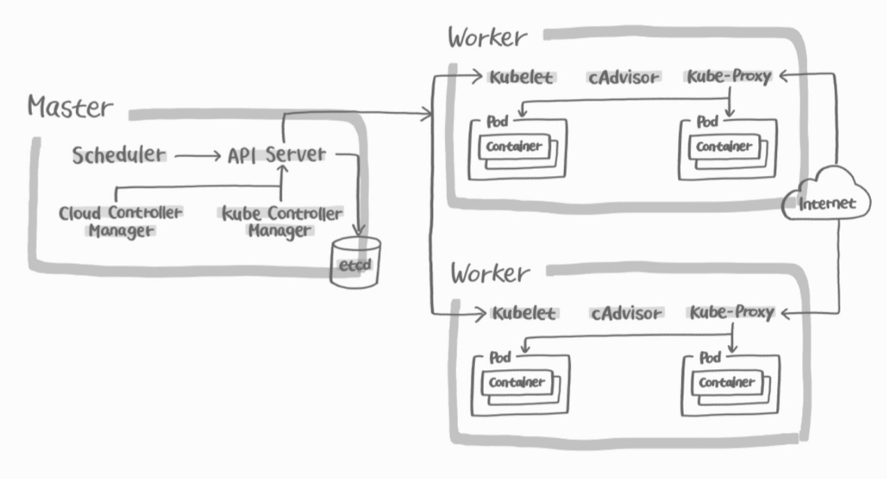

# 파드(Pod)
- 쿠버네티스 API 내에 정의되어 있는 객체다.
- 클러스터에 배치될 수 있는 가장 작은 원자적 단위이다.
- 클러스터 노드에서 컨테이너로 실행되는 하나 이상의 OCI 이미지이다.
- 다른 쿠버테니스 API 객체들은 파드를 직접 사용하거나 파드를 지원하는 API 객체들이다.
- 대부분의 경우 파드는 직접 배포되지 않고 정의된 디플로이먼트, 잡, 스테이트풀셋, 데몬셋과 같은 다양한 API 객체에 의해 자동으로 생성된다.
- 쿠버네티스의 목적이 파드들을 안정적이고 효율적으로 클러스터 내에서 실행시키는 것이다.

## 쿠버네티스의 파드 운영


- 개발자가 작성한 설정 정보를 바탕으로 쿠버네티스를 클러스터 내에서 파드들을 운영한다.
- 파드들은 쿠버네티스 노드에 배치되어 그 노드에서 실행된다.
- 파드에 버그가 발생하면 그 파드를 종료하고 새로운 파드를 재실행 시킨다.
- 파드의 버전이 업그레이드 되면 예전 버전의 파드를 제거하고 새로운 버전의 파드를 실행시킨다.

## 파드와 컨테이너
파드 내 컨테이너는 네트워크 네임스페이스, IPC 네임스페이스, 스토리지를 공유한다.
- 기본적으로 하나의 파드에는 하나 이상의 컨테이너가 포함된다.
- 파드는 노드 IP와 별개로 하나의 private IP 주소가 부여된다.
- 파드 내 컨테이너들은 컨테이너가 속한 파드의 IP 주소를 이용해 접근할 수 있으며 여러 컨테이너가 있을 경우 포트로 구분한다.
- 파드는 기본적으로 반영속적이다. 구동 중인 상태를 유지하기 위해 동원되는 일회성 자원이며 필요에 따라 언제든 삭제될 수 있다.
- IPC 네임스페이스를 공유하므로 같은 파드 내 컨테이너끼리는 IPC 통신이 가능하다.(IPC: 프로세스 간 통신)
- 파드 내 컨테이너들에게만 공유되는 스토리지를 지정할 수 있다.
- 외부 사용자가 파드에 접근하기 위해서는 Service 라는 쿠버네티스 리소스를 통해 접근해야 한다.
- 파드의 생명주기와 파드 내 컨테이너들의 생명주기가 같지는 않다.
- 컨테이너 하나에 문제가발생하면 그 컨테이너만 재실행하면 되지만, 반대로 파드에 문제가 발생하면 파드에 포함된 모든 컨테이너가 재샐행된다.

## 파드 실행
### 개발자의 역할
- 애플리케이션 개발
- 파드들을 어떻게 운영할지 쿠버네티스에게 알려주는 것

### 쿠버네티스 동작
- 개발자의 실행 요청에 따라 클러스터 내에서 안정적이고 효율적으로 파드를 스케줄링(해당 파드를 어떤 노드에서 실행시킬지 결정)한다.
- 클러스터의 개별 노드는 자신에게 할당된 파드들을 실행시킨다.

### 예시 설정 파일
```yaml
apiVersion: v1
kind: Pod
metadata:
  name: name-pod
  labels:
    app: test
spec:
  containers:
    - name: myapp
      image: my.io/myapp:v1
      resources:
      	requests:
          memory: "512Mi"
          cpu: "500m"
      	limits:
          memory: "1024Mi"
          cpu: "1000m"
    - name: mydb
      image: mysql
```
- 두 개의 컨테이너(my.io/myapp:v1, mysql)를 포함한 파드를 생성
- myapp의 경우 CPU 500m(CPU 0.5개 사용), 메모리 512MB(최대 1024MB)를 할당

### 파드 상태
```kubectl get pods``` 출력 결과 중 STATUS 필드에서 볼 수 있다.
- Pending
    - 클러스터 내 파드 생성이 승인되었지만 아직 내부의 컨테이너가 완전히 시작되기 전이며 노드에 배치되지 않은 상태이다.
- Running
    - 파드가 클러스터의 특정 노드에 배치되었으며 내부의 모든 컨테이너가 생성 완료된 상태다.
    - 하나 이상의 컨테이너가 구동되기 시작했거나 시작되는 중이다.
- Succeeded
    - 파드 안의 컨테이너가 유한한 수의 작업을 실행한 후 종료되도록 설계되었을 때만 볼 수 있다.
    - 파드에 있는 모든 컨테이너가 해당 작업을 마치고 정상적으로 종료된 것이다.
- Failed
    - 파드 안의 컨테이너가 유한한 수의 작업을 실행한 후 종료되도록 설계되었을 때만 볼 수 있다.
    - 파드에 있는 컨테이너 중 하나 이상이 비정상 종료되었을 때만 발생한다.
- unknown
    - 파드의 상태 확인이 불가한 경우다.
    - 보통 해당 노드의 네트워크 문제로 발생한다.
- terminating
    - 파드를 삭제시켰을 때 30초의 유예 시간 후에 완전히 삭제된다.

### 상태 진단을 위한 프로브(Probe)
컨테이너 상태를 진단하여 재시작 또는 종료가 필요한지 여부를 확인할 수 있게 해준다.
#### 프로브의 동작 방식
- HTTP 방식: HTTP GET 요청을 보내서 2XX 또는 3XX 응답이 오는지 체크한다.
- TCP 방식: TCP의 3-Way Handshake가 잘 맺어졌는지 체크한다.
- Exec 방식: 컨테이너에 특정 명령을 실행해서 종료 코드가 0인지 체크한다.
#### 진단 결과
- Success: 성공
- Unknown: 진단 실패
- Failure: 실패, kubelet이 이를 감지하여 재시작 정책에 따라 필요한 작업을 수행한다.

#### 프로브
- Liveness Probe
    - 컨테이너가 멈추거나 비정상 종료되면 해당 컨테이너를 재시작한다.
    - 버그 등으로 인해 병목 현상이나 메모리 누수가 발생할 경우 프로세스가 아예 멈출 수 있으므로 주의해야 한다.
- Readiness Probe
    - 컨테이너가 요청을 처리할 수 없는 상황이 되면 해당 파드로 로드밸런싱을 중단시킨다.
    - 파드 자체는 그대로 둔다.
- Startup Probe
    - 컨테이너가 시작되어 정상 구동되는 시점을 감지한다.
    - 그 전까지는 다른 프로브의 동작을 막는다.


### 재시작 정책
파드에 포함된 각 컨테이너에 오류가 생겼을 때 재시작하기 위한 정책을 ```spec.restartPolicy```를 통해 직접 부여할 수 있다.
- Always: 컨테이너가 정상/비정상 종료 시 항상 재시작한다. 기본값이다.
- Onfailure: 컨테이너가 오직 비정상 종료되었을 때에만 재시작한다.
- Never: 재시작하지 않는다.


## 참고자료
- https://seongjin.me/kubernetes-pods
- https://computing-jhson.tistory.com/102
