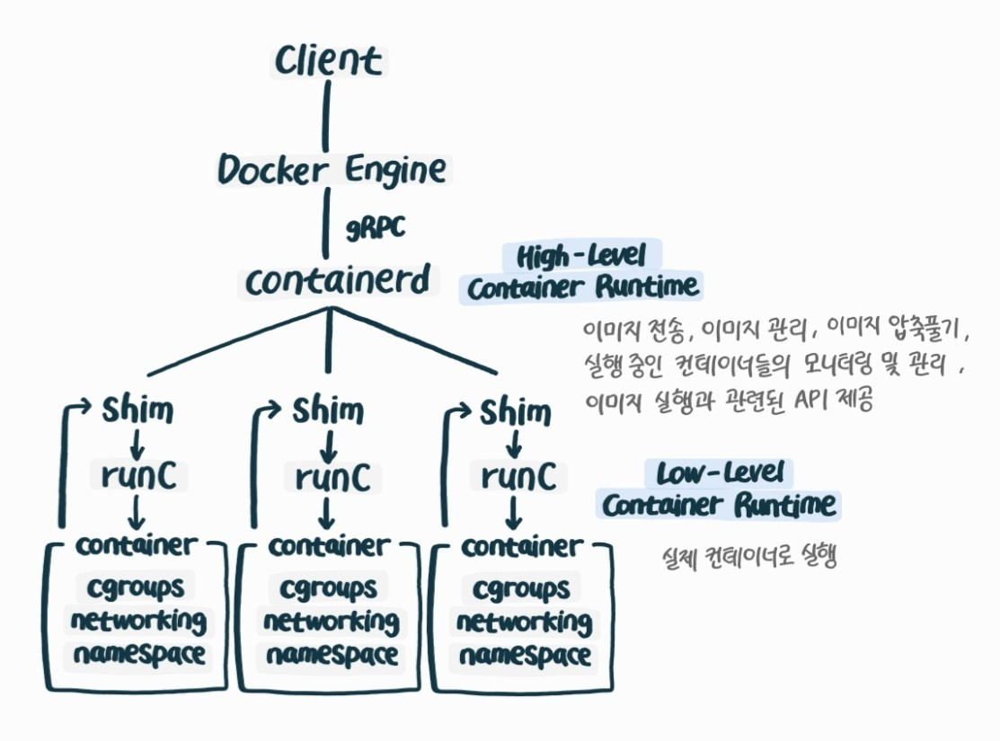

# 왜 쿠버네티스인가?
## 컨테이너와 이미지 기본
- 컨테이너는 실행 중인 이미지다.
- 이미지 내부에는 리눅스 바이너리나 애플리케이션 파일 같은 것을 포함한다.
- 컨테이너를 실행할 때 컨테이너 런타임(도커 등)은 이미지를 가져와 실행한다.

### OCI(Open Container Initiative)
컨테이너 런타임과 이미지 관련 업계 개방형 표준을 만드기 위해 레드헷과 도커 등의 여러 기업에 의해 설립된 Linux Foundation 산하의 오픈소스 단체이다.

#### 등장 배경
- 컨테이너를 빌드 및 실행하고 네트워크, 스토리지, CLI까지 제공해주는 Docker Engine이라는 패키지가 있었다.
- 당시 도커에 의존적이던 쿠버네티스에서는 새 도커 버전이 나올 때마다 영향을 받았다.
- 이를 계기로 컨테이너에 대한 기술 표준을 정하는 OCI 프로젝트가 시작되었다.
- Container Runtime에 대한 표준을 만들고 이를 실행할 수 있는 추상화된 인터페이스인 CRI(Container Runtime Interface) 스펙을 제공함으로써 docker 버전과 무관하게 containerd 표준을 준수하는 어떠한 이미지도 kubernetes에서 실행 가능하게 되었다.

### containerd
- Docker에서는 Container Engine으로 containerd를 사용 중이며 OCI 표준을 준수한다.
- Docker를 설치하면 자동으로 설치된다.(Docker Engine에 탑재)
- containerd가 OCI 표준을 기반으로 만들어졌기 때문에 kubernetes에서 무리 없이 관리될 수 있다.
- Docker v1.11 이후부터 적용되었다.

### Container Runtime 표준화
Docker는 Container Runtime 표준화 단계에서 실제 컨테이너로 실행시키는 단계(3단계)만 표준화한다.
1. 이미지 pull
2. 이미지 압축 해제
3. 컨테이너화

#### Low-Level Container Runtime
컨테이너를 직접 실행하는 역할을 한다.
- namespace와 cgroup을 설정한다.
- namespace, cgroup 내에서 명령을 실행한다.
- cgroup과 namespace는 모두 kernel의 기능이다.
    - cgroup: 각 컨테이너가 사용할 CPU, 메모리, 네트워크, I/O, 디바이스 등의 자원을 제어
    - namespace: 각 컨테이너에 파일 시스템이나 네트워크와 같은 시스템 resource를 격리, 가상화

#### High-Level Container Runtime
고수준 컨테이너 런타임은 저수준 컨테이너 런타임에 대한 configuration을 진행하고 실제 이에 대한 실행은 저수준 컨테이너 런타임에서 수행된다.
- 컨테이너 이미지 push, pull, 압축 관리
- 컨테이너에 할당할 resources 관리
- 컨테이너 간 네트워킹 관리
- Low-level Container Runtime에 명령 전달(논리적 컨테이너 실행)
- 컨테이너 간 라이프사이클 관리

 

## 쿠버네티스 기본
- 모든 것을 yaml이나 json으로 정의된 일반 텍스트로 정의하고 선언적인 방식으로 이미지를 실행한다.
- 직접 클러스터에 있는 앱의 원하는 상태, 네트워킹 방법, 실행 위치, 사용하는 스토리지 등을 정의할 수 있지만 기본적인 세부 사항의 구현은 쿠버네티스에 위임한다.
- 쿠버네티스는 변경 사항을 적용하고 변경을 모니터링하며 원하는 최종 상태에 도달하게 한다.

### 전형적인 실패에 대한 대처 시나리오
1. 노드가 컨트롤 플레인에 대한 응답을 멈춘다.
2. 컨트롤 플레인이 응답하지 않는 노드에서 실행 중인 파드를 다른 노드에 다시 할당한다.
3. 사용자가 kubectl을 통해 API 서버로 호출하면 API 서버는 응답하지 않는 노드와 파드의 새로운 위치에 대한 올바른 정보를 응답한다.
4. 파드의 서비스와 통신하는 모든 클라이언트는 파드의 새로운 위치로 라우팅한다.
5. 기존 데이터를 계속 읽을 수 있게 오류가 발생한 파드에 연결된 스토리지 볼륨은 새로운 파드 위치로 이동한다.

### 쿠버네티스 컴포넌트와 아키텍처
- 하드웨어 인프라: 컴퓨터, 네트워크 인프라, 스토리지 인프라, 컨테이너 레지스트리를 포함한다.
- 워커 노드: 쿠버네티스 클러스터의 기본 컴퓨팅 단위이다.
- 컨트롤 플레인: 쿠버네티스의 모체로 API 서버, 스케줄러, 컨트롤러 관리자와 다른 컨트롤러를 포함한다.
