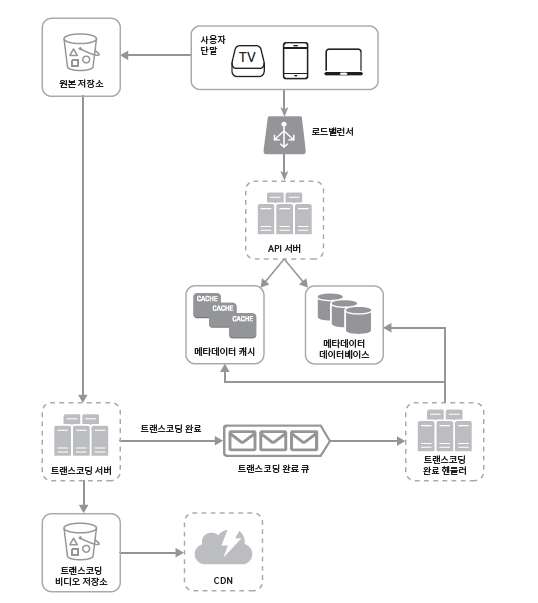
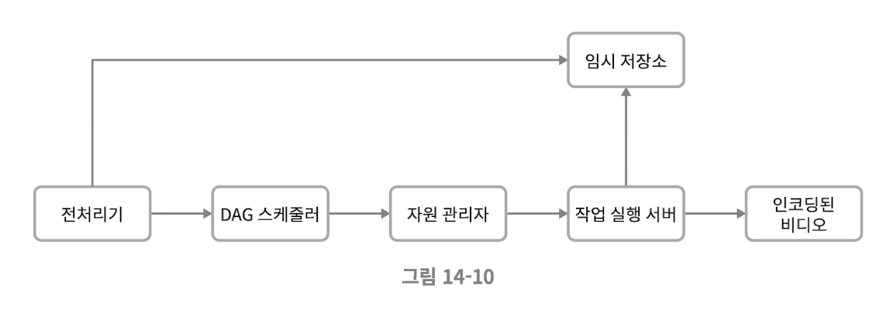

## 유튜브 설계
### 1단계) 문제 이해 및 설계 범위 설정
#### 비디오 스트리밍 서비스 기능
- 비디오 올리기
- 비디오 시청하기
- 댓글 남기기
- 비디오 공유하기
- 좋아요 누르기
- 재생목록에 저장하기
- 채널 구독하기
> 면접 시 모든 기능을 설계하는 것은 불가능하므로 적절한 질문을 통해 중요한 기능 위주로 설계 범위를 좁힐 것

#### 설계 대상 기능
- 빠른 비디오 업로드
- 원활한 비디오 재생
- 재생 품질 선택
- 낮은 인프라 비용
- 높은 가용성과 규모 확장성, 안정성
- 지원 클라이언트: 모바일 앱, 웹 브라우저, 스마트 TV

#### 계략적 규모
- 사용자 수: 일간 능동 사용자 5백만
- 평균 시청 개수: 한 사용자는 하루 평균 5개 시청
- 업로드 개수: 10%의 사용자가 하루에 1개 비디오 업로드
- 비디오 크기: 비디오 평균 크기 300MB
- 비디오 용량: 비디오 저장을 위해 요구되는 저장 용량 150TB(5백만 * 10% * 300MB)
- CDN 비용 $150,000(5백만 * 5비디오 * 0.3GB * $0.02)
  
> **CDN(Content Delivery Network)**   
> 지리적으로 분산된 서버들을 연결한 네트워크로 전 세계 사용자에게 빠르게 콘텐츠를 전송할 수 있는 콘텐츠 전송 기술
> - 왜 사용할까?
>   - 사용자가 경험하는 로딩 시간 단축
>   - 대역폭 사용량 감축(원래 서버로부터 데이터 전송량을 줄임)
> - 어떻게 동작할까?
>   - 각 지역에 캐시 서버를 배치해 근접한 사용자의 요청에 원본 서버가 아닌 캐시 서버가 콘텐츠를 전달
> - 언제 필요할까?
>   - 동영상 스트리밍이나 온라인 게임, 대용량 파일 전송, 용량이 큰 이미지를 다루는 쇼핑몰 등에서 사용
>   - 특정 국가나 지역을 타깃으로 하는 경우 필요 없음(불필요한 연결 지점만 늘어나 오히려 성능 저하)
> - 대략 얼만큼의 비용이 발생할까?
>   - 아마존 클라우드 사용 시 1GB 당 $0.02 발생

 

### 2단계) 개략적 설계안 제시 및 동의 구하기
#### 시스템 구성
- 단말: 모바일 기기, 컴퓨터, 스마트 TV
- CDN: 비디오 저장소
- API 서버: 비디오 스트리밍 제외 모든 요청 처리(ex. 피드 추천, 사용자 가입 등)

#### 비디오 업로드 절차

- 컴포넌트
  - 사용자
  - 로드밸런서
  - API 서버
  - 메타데이터 데이터베이스: 비디오 메타데이터 보관(파일 이름, 크기, 포맷 등)
  - 메타데이터 캐시
  - 원본 저장소: 이진 파일 저장소(BLOB)
  - 트랜스코딩 서버: 단말이나 대역폭 요구사항에 맞는 스트림을 제공하기 위해 필요
  - 트랜스코딩 비디오 저장소
  - CDN
  - 트랜스코딩 완료 큐
  - 트랜스코딩 완료 핸들러: 완료 큐에서 이벤트를 꺼내 메타데이터 캐시와 데이터베이스 갱신

> **트랜스코딩**   
> 해상도, 인코딩, 비트 전송률과 같은 매개 변수를 조정하여 비디오 파일을 한 형식에서 다른 형식으로 변환하는 프로세스

- 프로세스
1. 비디오 업로드
   1. 원본 저장소에 업로드
   2. 트랜스코딩
   3. 트랜스코딩 비디오를 저장소로 업로드하고 완료 이벤트를 큐에 넣어 메타데이터 데이터베이스랑 캐시 갱신
   4. API 서버가 단말에게 비디오 업로드 완료 알림
2. 메타데이터 갱신
   1. 저장소에 파일이 업로드되는 동안 비디오 메타데이터 갱신 요청을 API 서버에 전달하여 업데이트

#### 비디오 스트리밍 절차
1. 비디오 재생 버튼 클릭
2. 사용자 단말에서 가장 가까운 CDN 서버에서 바로 스트리밍
> **스트리밍 프로토콜**   
> - 비디오 스트리밍을 위해 데이터를 전송할 때 쓰이는 표준화된 통신 방법
> - 프로토콜마다 지원하는 비디오 인코딩과 플레이어가 다르므로 서비스에 맞는 프로토콜 선택

 

### 3단계) 상세 설계
#### 비디오 트랜스코딩
- 필요성
  - 원본 비디오는 많은 저장 공간 차지
  - 단말 호환성 문제
  - 네트워크 대역폭에 따른 화질 설정
  - 수동 설정 변경 필요
- 작업 내역
  - 검사
  - 비디오 인코딩
  - 썸네일
  - 워터마크

> **DAG 채택(DAG, Directed Acyclic Graph)**   
> 유향 비순환 그래프 모델
> - 유연성: 각 창작자는 자기만의 비디오 프로세싱 요구사항이 있음, 실행할 작업을 손수 정의
> - 병렬성: 작업을 단계별로 나열할 수 있도록 하여 해당 작업들을 순차적 또는 병렬적으로 실행

#### 비디오 트랜스코딩 아키텍처

- 전처리기
  - 비디오 분할: 비디오 스트림을 GOP 단위로 쪼갬
  - DAG 생성: 프로그래머가 작성한 파일에 따라 작업 생성
  - 데이터 캐시: GOP와 메타데이터를 임시 저장소에 보관, 인코딩 실패 시 보관된 데이터를 활용해 재개
- DAG 스케줄러
  - DAG 그래프를 몇 개의 단계로 분할
  - 자원 관리자의 작업 큐에 추가
- 자원 관리자
  - 자원 배분 수행
    - 작업 큐: 실행할 작업 보관
    - 작업 서버 큐: 작업 서버의 가용 상태 정보 보관
    - 실행 큐: 현재 실행 중인 작업 및 작업 서버 정보 보관
    - 작업 스케줄러: 최적의 작업/서버 조합을 골라 작업 지시
- 작업 실행 서버
  - DAG에 정의된 작업 수행
- 임시 저장소
  - 어떤 저장소 시스템을 사용할지 선택

#### 시스템 최적화
- 속도 최적화
  - 비디오 병렬 업로드: GOP로 분할하여 병렬로 업로드하여 실패하더라도 빠르게 재개
  - 업로드 센터를 사용자 근거리에 지정: 업로드 센터를 여러 곳에 두는 방안으로 CDN 선택
  - 모든 절차를 병렬화
    - 느슨하게 결합된 시스템을 만들어 병렬성을 높임
    - 메시지 큐를 도입하여 작업이 끝나기를 기다리지 않고 이벤트 각각을 병렬 처리
- 안전성 최적화
  - 미리 사인된 업로드 URL: 미리접근 권한이 있는 URL을 부여받고 해당 URL에 업로드
  - 비디오 보호 방안 채택
    - 디지털 저작권 관리(DRM)
    - AES 암호화
    - 워터마크
- 비용 최적화
  - CDN 비용 절감 방안
    - 인기 비디오와 비인기 비디오를 구분: 인기 비디오는 CDN에서, 비인기 비디오는 비디오 서버에서 재생
    - 특정 지역에서만 인기가 높은 비디오를 구분: 다른 지역이 옮기지 않고 사용
    - CDN 직접 구축 후 ISP와 제휴

#### 오류 처리
- 회복 가능 오류: 특정 비디오 트랜스코딩 실패 -> 재시도
- 회복 불가능 오류: 비디오 포맷 오류 -> 비디오 작업 중단

 

### 4단계) 마무리
#### 추가로 논의할 내용
- API 계층의 규모 확장성 확보 방안
- 데이터베이스 계층의 규모 확장성 확보 방안
- 라이브 스트리밍: 짧은 응답 지연 시간 필요, 작은 단위의 데이터 실시간 처리로 병렬 처리 필요성 저하
- 비디오 삭제

 

### 요약
- 이벤트 큐와 병렬 처리
- CDN 사용
- 메타데이터 보관과 캐싱