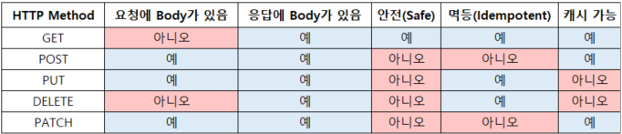
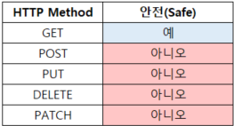
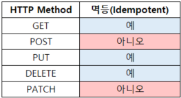
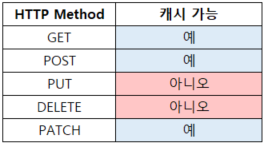

# HTTP Method

## HTTP Method 종류
서버가 수행해야 할 동작을 지정하여 요청을 보내는 방법
- GET: 리소스 조회
- POST: 메시지 바디를 통해 서버로 요청 데이터 전달, 주로 신규 리소스의 등록에 사용
- PUT: 목적 리소스를 현재 메시지의 값으로 생성하거나 기존 리스소를 삭제하고 덮어쓰기
- PATCH: 리소스 부분 변경
- DELETE: 리소스 삭제

## HTTP Method 속성
- 안전성(Safe)
- 멱등(Idempotent)
- 캐시 가능(Cacheable)
  

### 안전성(Safe)
호출해도 서버의 상태를 바꾸지 않는 성질

- 읽기 작업만 수행하는 메서드는 안전하다.
- 꼭 읽기 전용이어야 하는 건 아니고, 서버가 요청 정보와 통계 등을 기록함으로써 자신의 상태에 변경을 가하는 것도 가능하다.
- 모든 안전한 메서드는 멱등성도 갖지만, 멱등성을 지닌 모든 메서드가 안전한 것은 아니다.
- 클라이언트가 서버의 상태 변화를 직접 요청하지 않아 서버에 불필요한 부하를 주지 않을 것이므로 자유롭게 호출할 수 있다.
- GET 메서드는 단순히 데이터를 조회하므로 안전한 HTTP 메서드이다.
- 반면에 POST/PUT/PATCH/DELETE 메서드는 데이터에 변경이 발생하거나 삭제되므로 안전하지 않은 HTTP 메서드이다.

### 멱등성(Idempotent)
연산을 여러 번 적용해도 결과가 달라지지 않고 한 번만 수행된 것과 같은 성질

- `f(f(x)) = f(x)`를 만족시키는 성질이다.
- 절대값을 구하기 위해 사용하는 `abs()` 함수가 멱등성을 가진다.
- 작업 수행 요청이 최소 한 번 발생하도록 보장되지만 두 번 이상 발생할 수도 있는 네트워크 프로토콜 설계에 자주 사용된다.
- 멱등성을 따질 때는 HTTP 응답 Status와 상관없이 서버의 상태만 비교하고 외부 요인으로 인해 중간에 리소스가 변경되는 것은 고려하지 않는다.
- HTTP Spec에 명시된 것에 의하면 GET, PUT, DELETE 메서드는 멱등성을 가지도록, POST, PATCH 메서드는 멱등성을 가지지 않도록 구현해야 한다.

> **안전성과 멱등성**
> 안전성은 한 번을 호출하던 여러 번을 호출하던 리소스에 수정이 발생하지 않는 속성이다.
> 멱등성은 리소스에 수정이 발생해도 메서드를 여러 번 실행한 것과 한 번 실행한 결과가 같다면 만족하는 속성이다.

### 멱등적이지 않은 설계
#### GET
- 게시글을 조회하면 조회수를 올리도록 구현한 경우
1. GET /board/1
2. 서버에서 id 값이 1인 게시글 조회
3. 해당 게시글의 조회수 1 증가
4. 데이터 응답

> HTTP 스펙에 부합하지 않게 API를 구현한 것이다.
> 조회수 컬럼의 값을 증가시키는 요청을 PATCH로 분리해야 한다.

#### DELETE
- 마지막 게시글을 삭제하도록 구현한 경우
1. DELETE /board/last
2. 마지막 게시글 삭제
3. 다시 요청 시 또 다른 마지막 게시글 삭제

> HTTP 스펙 상 DELETE로 구현하려면 정확한 식별자로 리소스를 지정해야 한다.
> 이런 경우에는 멱등성을 가지지 않는 POST를 사용해야 한다.

#### PATCH
- PATCH는 기본적으로는 멱등성을 가지지 않는 메서드인데 그 구현을 PUT과 동일한 방식으로 할 경우 멱등성을 가지게 되는 특성을 지닌다.
- PUT 메소드는 반드시 멱등성을 보장하지만 PATCH 메소드는 멱등성을 보장하지 않을 수도 있다.
1. PATCH /users/1 {age: {value: 1}}
2. age를 1만큼 증가하는 변경

### 캐시 가능(Cacheable)
응답 결과 리소스를 캐싱해서 효율적으로 사용할 수 있는가에 대한 여부

- 브라우저의 캐시를 이용하려면 원본 데이터가 변경되지 않고 유지되어야 하는데 POST, PUT, DELETE, PATCH는 기본적으로 데이터 변경이 되는 메서드이므로 캐시 불일치가 생길 문제가 있어 GET, HEAD 정도에만 이용한다.

## 참고자료
- https://inpa.tistory.com/entry/WEB-%F0%9F%8C%90-HTTP%EC%9D%98-%EB%A9%B1%EB%93%B1%EC%84%B1-%C2%B7-%EC%95%88%EC%A0%95%EC%84%B1-%C2%B7-%EC%BA%90%EC%8B%9C%EC%84%B1-%F0%9F%92%AF-%EC%99%84%EB%B2%BD-%EC%9D%B4%ED%95%B4%ED%95%98%EA%B8%B0
- https://hudi.blog/http-method-idempotent/
- https://june0122.github.io/2021/08/05/term-idempotent/