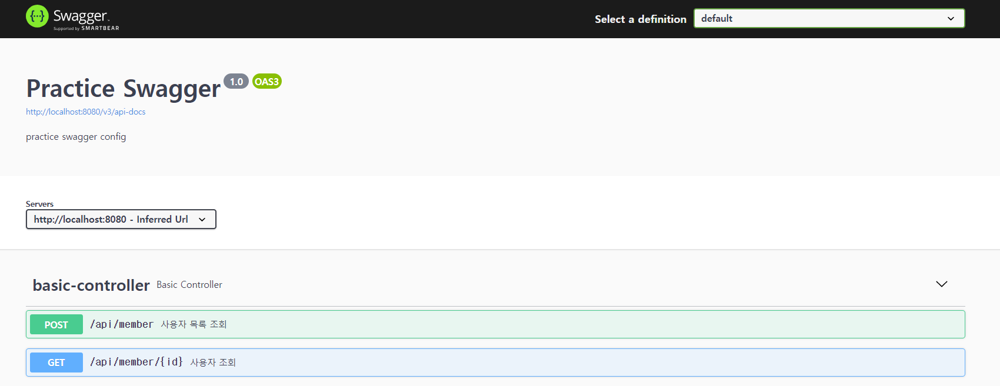
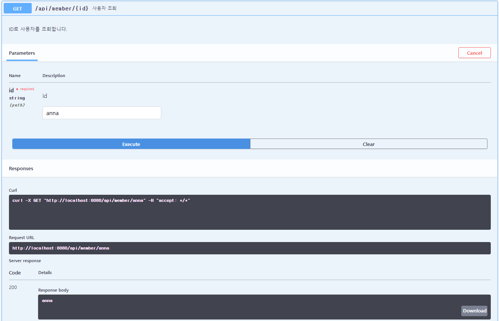

# OpenAPI Spec과 Swagger
## OpenAPI
OpenAPI Specification(OAS)라고도 하는 OpenAPI는 RESTful API를 기정의된 규칙에 맞게 API Spec을 json이나 yaml로 표현하는 방식을 의미한다.
- RESTful API 를 기술하는 표준으로 서비스에서 제공하는 API 의 기능과 End Point 를 개발자나 시스템이 자동으로 발견하고 처리하는데 필요한 정보를 제공한다.
- 전에는 Swagger 2.0과 같은 이름으로 불렸다가 3.0버전으로 올라오면서 OpenAPI 3.0 Specification(또는 Swagger 3.0)으로 칭한다.

> **OpenAPI? OpenAPI?**   
> Open API(Open Application Programming Interface, 공개 API)는 누구나 사용할 수 있도록 공개된 API를 말한다. Public API라고도 부른다.

<br>

## Swagger
REST API를 설계, 빌드, 문서화 및 사용하는데 도움이 되는 OpenAPI 사양을 중심으로 구축된 오픈소스 문서화 도구이다.
- API 명세서를 직접 작성하는 대신 Swagger를 사용해 API를 문서화할 수 있다.
- Spring REST Docs와 달리 코드 몇 줄만 추가하여 만들 수 있다.
- 문서 화면에서 API를 바로 테스트할 수 있다.

## spring boot with swagger 3.0
1. Swagger 사용을 위한 의존성 추가(springfox 사용)
```Groovy
implementation "io.springfox:springfox-boot-starter:3.0.0"
implementation "io.springfox:springfox-swagger-ui:3.0.0"
```

2. Swagger 설정
```java
@Configuration
public class SwaggerConfig {
    @Bean
    public Docket api() {
        return new Docket(DocumentationType.OAS_30)
                .useDefaultResponseMessages(false)
                .select()
                .apis(RequestHandlerSelectors.basePackage("com.example.sample.controller"))
                .paths(PathSelectors.any())
                .build()
                .apiInfo(apiInfo());
    }

    private ApiInfo apiInfo() {
        return new ApiInfoBuilder()
                .title("Practice Swagger")
                .description("practice swagger config")
                .version("1.0")
                .build();
    }
}
```

3. Swagger-ui 접속하여 확인
- Swagger2: http://localhost:8080/swagger-ui.html
- Swagger3: http://localhost:8080/swagger-ui/index.html


4. Controller에 API 작성하고 설명 추가
```java
@RestController
public class BasicController {
    @PostMapping("/api/member")
    @ApiOperation(value = "사용자 목록 조회", notes = "가입된 사용자 목록을 조회합니다.")
    public List<String> getMemberList() {
    	List<String> memberList = Arrays.asList("anna", "tom", "grace");
        return memberList;
    }

    @GetMapping("/api/member/{id}")
    @ApiOperation(value = "사용자 조회", notes = "ID로 사용자를 조회합니다.")
    public String getMemberById(@PathVariable("id") String id) {
    	List<String> memberList = Arrays.asList("anna", "tom", "grace");
    	return memberList.stream()
    			.filter(item -> item.equals(id))
    			.findAny()
    			.orElse(null);
    }
}
```

5. 다양한 파라미터로 API 호출하여 테스트
